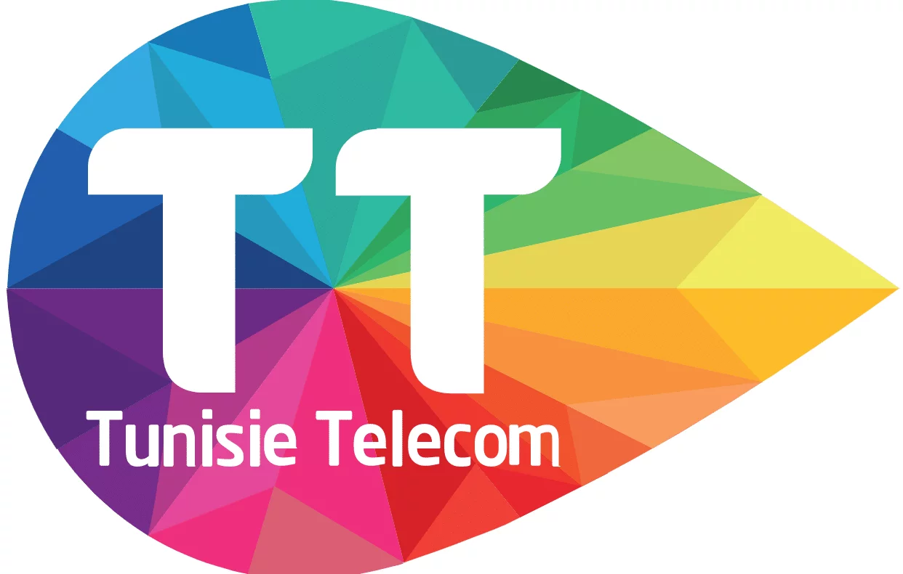

# Tunisie Telecom Dashboard

A comprehensive web application for managing clients, offers, and business operations for Tunisie Telecom.



## Features

- **Admin Authentication**: Secure login system for authorized personnel
- **Client Management**: Full CRUD operations for client records
- **Offer Management**: Create and manage service offerings
- **Data Import/Export**: Excel-based data handling
- **Reports & Analytics**: Visual data analysis and reporting
- **Responsive Design**: Mobile-friendly interface

## Installation

1. Clone the repository:
```bash
git clone https://github.com/anas11133/tunisie-telecom-dashboard.git
cd tunisie-telecom-dashboard